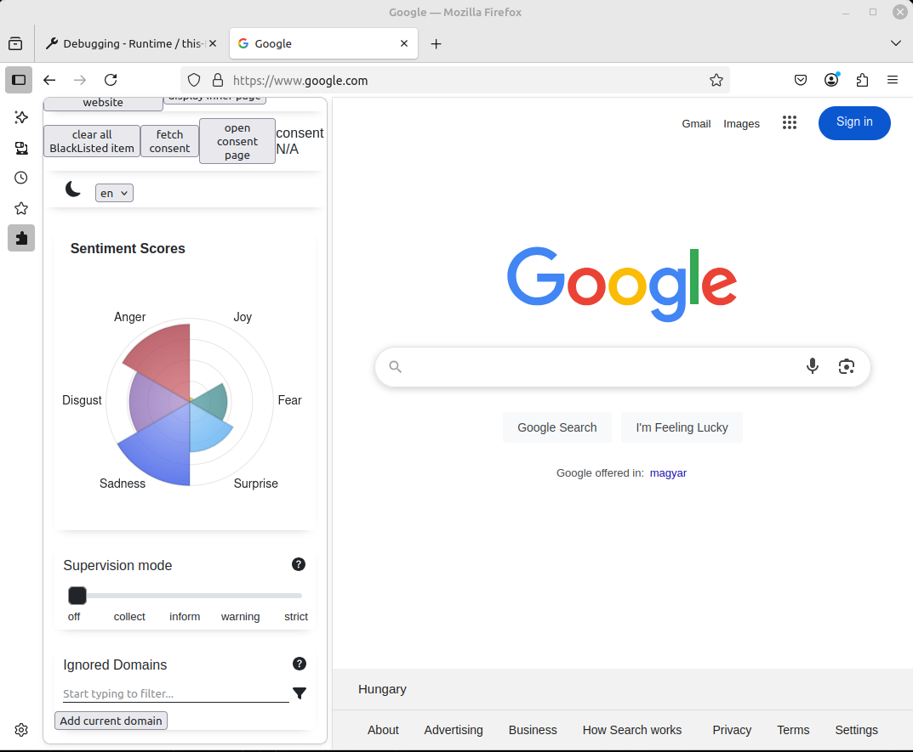

# Browser-compatibility

Currently this extension only works in chromium-based browsers. It wasn't in the scope to make it work elsewhere (like Firefox).

## Make it cross-browser

Since we didn't use any advanced things, there are two things that need to be done to make it [cross-browser](https://developer.mozilla.org/en-US/docs/Mozilla/Add-ons/WebExtensions/Build_a_cross_browser_extension).
(Except for Safari, mentioned that later.)

### browser variable

In Safari and Firefox the `browser` namespace is present, meanwhile in chrome the `chrome` namespace is used.
([Firefox](https://developer.mozilla.org/en-US/docs/Mozilla/Add-ons/WebExtensions/Chrome_incompatibilities#firefox_supports_both_the_chrome_and_browser_namespaces) and [Safari](https://developer.apple.com/documentation/safariservices/assessing-your-safari-web-extension-s-browser-compatibility#Review-your-implementation-plan) provides `chrome` namespace).

However to make `browser` namespace available for chrome basically just make a global reference called `browser` and point it to the `chrome` namespace.

Create a `browser.d.ts` [ambient module](https://www.typescriptlang.org/docs/handbook/modules/reference.html#ambient-modules) with this content:
```typescript
/* eslint-disable no-var */
// The reason why we need var https://stackoverflow.com/a/69429093
// browser.d.ts is an ambient module
export declare global {
  export var browser: typeof chrome;
}
```

Create an `init-browser-global.ts` file with the following content:
```typescript
export const initBrowserGlobal = (): void => {
  if (typeof browser == "undefined") {
    // Chrome does not support the browser namespace yet.
    globalThis.browser = chrome;
  }
}
```

In the beginning of every application part import and execute the `initBrowserGlobal` function, and you are good to go 🙂

### sidebar or sidepanel?

This is a bit more cumbersome to overcome.
First of all I didn't find any equivalent in Safari, and [this stackoverflow answer](https://stackoverflow.com/a/66449964) reassured me.

The [difference](https://developer.mozilla.org/en-US/docs/Mozilla/Add-ons/WebExtensions/Chrome_incompatibilities#sidebar_api) between firefox and chrome is that chrome uses its SidePanel API, meanwhile firefox uses Sidebar API.
The manifest keys are named respectively, but that's the least problem.

```json
"sidebar_action": {
  "default_panel": "src/SidePanel/index.html"
},
"side_panel": {
  "default_path": "src/SidePanel/index.html"
},
```

The [only direct usage](../../src/worker/worker.ts?plane1#L75) of SidePanel API is in *worker.ts*.
Here we make the default icon open the side panel.

To make the same behavior in firefox we need to do this:
```typescript
const isChrome = !!chrome.sidePanel;
if (isChrome) {
  chrome.sidePanel
    .setPanelBehavior({ openPanelOnActionClick: true })
    .catch((error) => console.error(error));
} else {
  browser.action.onClicked.addListener(() => {
    browser.sidebarAction.toggle();
  });
}
```

P.S. Tried out these changes, and it worked for me in firefox (without switching from `chrome` namespace to `browser` namespace)

