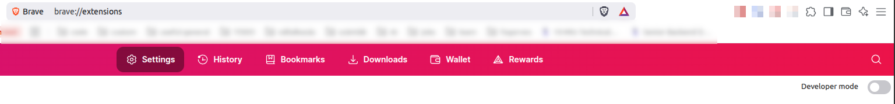
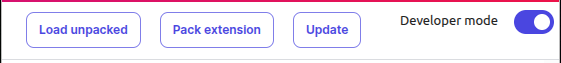
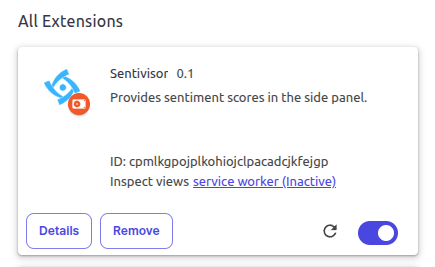

# Build and use chrome extension

It must be mentioned that this extension is only compatible with chromium-based browsers.
To see an elaboration on this topic, check out [browser-compatibility doc](./browser-compatibility/browser-compatibility.md).

In order to try out this extension, first we need to understand how the app is assembled.

## Missing localization files

The thing is that we wanted to support multiple languages, so we included localization from the beginning of the project. Currently only the SidePanel part is localized and that's done with [lit-localization](https://lit.dev/docs/localization/overview/)

I don't want to go into details how it works, you can find it out for yourself, but the point is that we need to generate files which are related to localization, and they are referenced in production code.

To generate the missing files:
1. do `npm i`, so that lit-localize CLI is installed (locally).
1. go into src/SidePanel folder in a terminal
1. hit `npx lit-localize build`

In case you'd like to add/modify/remove localized texts, then (still in src/SidePanel):
1. Write in the terminal: `npx lit-localize extract`.
1. *hu.xlf* file is (re-)generated, there you can edit it by adding <target>translated text</target> for each record. In order to add more languages modify the targetLocales in [lit-localize.json](../src/SidePanel/lit-localize.json?plane1#4), then re-run the command and see *other-language.xlf* files.
1. After you are done write in the terminal `npx lit-localize build`.
1. You are done :)

For more information:
- [Official Localization docs from lit](https://lit.dev/docs/localization/overview/)
- [Official docs for Runtime localization mode from lit](https://lit.dev/docs/localization/runtime-mode/)

## tsconfig files

As mentioned in the [main readme](../README.md) there are separated typescript projects.
The first reason is that these parts are executed separately.
The second reason is that these parts are executed in different contexts. \
I.e.
- Worker is a background script, so it has nothing to do with DOM. So in its [tsconfig](../src/worker/tsconfig.json?plane1#5) you won't find the *DOM* lib.
- Meanwhile the [tsconfig of consent](../src/consent/tsconfig.json?plane1#5) has it

As all tsconfig extends the [shared tsconfig](../src/shared/tsconfig.json) (except of course itself), you can see that for each part we used bundler mode.

## Vite bundler

The used bundler is [vite](https://vite.dev/) and its config is [vite.config.ts](../vite.config.ts)
As the parts are standalone units, hence we needed to specify [entry points](https://rollupjs.org/configuration-options/#input) for each of them.

We decided to not minify the built code so it is [easier to review](https://developer.chrome.com/docs/webstore/review-process/#review-time-factors).

## Build process

A bundler is rarely responsible for typechecking (of course there are [plugins](https://www.npmjs.com/package/vite-plugin-checker) for them), therefore we first need to do the type-checking separately.

As in the shared config the [`noEmit`](../src/shared/tsconfig.json#19) is set to true, the `tsc` command does exactly the type-checking and only the checking.
Since we are using multiple projects we need to use the [`--build` flag](https://www.typescriptlang.org/docs/handbook/project-references.html#build-mode-for-typescript)

But for ease of use you can just execute [`npm run build`](../package.json?plane1#8).

## Load extension into chromium-based browser

After you succesfully built the app, the `dist` folder is present.
Open your chromium-based browser (personally I use [Brave](https://brave.com/))

1. Go to [chrome://extensions](chrome://extensions) (Brave automatically redirects to *brave://extensions*)
1. Turn on developer mode \
    
1. Select "Load unpacked" \
    
1. Select the `dist` folder
1. Enjoy the installed extension :) \
  

Here's [the official doc](https://developer.chrome.com/docs/extensions/get-started/tutorial/hello-world#load-unpacked) for installing an unpacked extension.