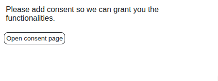

# Consent

In order to use this application you have to give consent, that we are going to send data from your browser to our backend, otherwise the extension [does not do anything](../src/content/content.ts?plane1#L36).

This data is not assigned to any account, but based on the data **it might be traceable**.

The consent management is handled by [ConsentStorage](./shared-unit.md#consentstorage). \
In case sidepanel is opened, it needs to handle consent changes. The fact that the consent has changed is sent with a [MessageMediator](./shared-unit.md#messagemediator).

<!-- TODO: link to content-unit how the data - which is sent to BE - selected & filtered (i.e. password, sensitive data, messages from a social media) + reason to make FE part open-source -->
The way how the data is extracted from websites and filtered is described in the [content unit docs](./content-unit.md).

