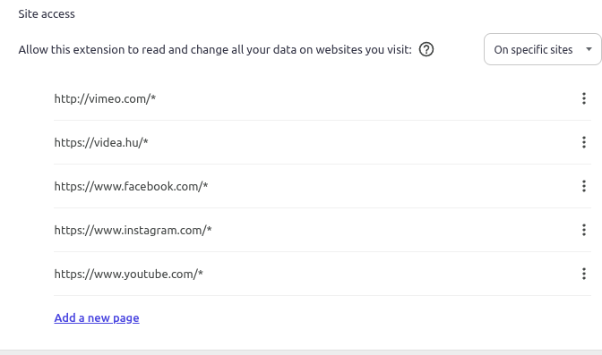

# Content

Content unit is the part that
- extracts the content of the website
- based on the [analyzer](./worker-unit.md#analyzer)'s evaluation and on the [supervision mode](./shared-unit.md#supervisionmode) it might change the website's content

## Extraction

First of all we used a very naive approach for the first iteration, namely we considered all websites as [immutable and static](./worker-unit.md#the-naive-approach-for-analyzing-websites).

The implementation of extraction reflected this approach: `document.body.innerText`. \
Why did we choose innerText and not textContent?
For that [read this first](https://developer.mozilla.org/en-US/docs/Web/API/Node/textContent#differences_from_innertext).

To put it in a nutshell, we wanted to extract only those texts which are visible for the user:
- in the viewport
- not hidden by css, js or html attribute

### Guard-clauses for extraction

Before we even try to extract anything from the website, we need to check [whether we can parse](../src/content/content.ts?plane1#L35) the website:
- Is the website [blacklisted](./shared-unit.md#blackliststorage)?
- Has the user given [consent](./consent-unit.md) to the data collection?
- Is the [supervision mode off](./shared-unit.md#supervisionmode)?
- Is the language that the website uses [supported by the extension](./shared-unit.md#miscellaneous)?

### Advanced extraction

In case we want to give a pretty good estimation on the mental health impact of a website, we should analyze only the content that is visible for the user.
(The user still might skip parts, although seeing things from peripheral vision can also have an impact.)

That means we should extract that part (as mentioned above):
- which is in the viewport
- which is not hidden by css, js or html attribute

However we should handle any changes in the viewport:
- user scrolled
- the content changed without action (i.e. content arrived after an initial loading)
- popup/tooltip opened
- due to resize of the window the viewport increased

I believe the only way to achieve such functionality is to use [IntersectionObserver](https://developer.mozilla.org/en-US/docs/Web/API/Intersection_Observer_API) and/or [MutationObserver](https://developer.mozilla.org/en-US/docs/Web/API/MutationObserver).

### Security concerns

Even though I believe the idea behind Sentivisor is wonderful, it brings serious security concerns.
As we are reading the content of the website, we have to be sure that we are not reading any sensitive data.

The user can visit websites such as
- banking websites
- social media websites (with private messages)
- websites which hold health data

Backend **does not retain any data** from the content.
However as backend does not trust frontend, neither frontend should trust backend.

Moreover the less we know, the smaller the chance is for a security breach.

**Currently no security layer is implemented in the extension.** \
We did not reach the point where we could implement it.

#### Mitigating security concerns

It's also a non-trivial task to decide whether a website might contain sensitive data.
(Not even talking about that within a site we distinguish between sensitive and non-sensitive data.)

##### Specify sites to access

The first thing that you can do to try out the extension without taking any risk is to allow the extension to run only on specific websites.
You can do that in the extension settings in your browser.

##### Implement Whitelist

The very same approach but inside the extension is to implement a whitelist.
This was my initial proposal instead of blacklist, but it was voted down by the team.

Anyway most of the time users go back to the same websites, meaning they know which are the sites that they care about the most from mental health perspective:
- social media
- news

If you just try to buy a gift for your friend, or go to a fastfood restaurant's website, or look for a recipe (meaning you try to find information on sites which you don't know yet), you'll see pretty much neutral content.

## Action based on the evaluation

The action consists of two steps.
First we need to consider whether the website is harmful or not. If it is, then we need to decide what to do with it.

### Consultant

A [consultant](../src/content/Consultant/Consultant.ts) is responsible for deciding whether the website is harmful or not based on the evaluation we got from backend.

The consultant later on can be affected by the user's preferences, but currently we only have a [DefaultConsultant](../src/content/Consultant/DefaultConsultant.ts).

### Supervisor

[Supervisor](../src/content/Supervisor/Supervisor.ts) is the one who receives the information from the consultant and acts based on it.

With the [SupervisionMode](./shared-unit.md#supervisionmode) the user can select the type of act one needs.
- [NoActSupervisor](../src/content/Supervisor/NoActSupervisor.ts) - does not do anything
- [InterveneSupervisor](../src/content/Supervisor/content-intervene/InterveneSupervisor.ts) - in some way intervenes in the website's content
  - It can inform the user with a simple emoji
  - It can block the website with a modal with the possibility to dismiss the modal
  - It can block the website with a modal without the possibility to dismiss the modal

The injected DOM from the InterveneSupervisor is encapsulated in [shadow DOM](https://developer.mozilla.org/en-US/docs/Web/API/Web_components/Using_shadow_DOM), so it does not affect the website's original content.

## Tech stack

An interesting question is why we didn't use dependency injection or lit here, while we have them in [side-panel](./side-panel-unit.md). \
There are two reasons:
1. For each tab the *content.js* is injected which means we might end up with a huge memory footprint
1. Since we are dealing with the content, therefore this part can immensely increase the loading time of a page if we don't pay enough attention to it.

Taking these into consideration, we decided to keep this as lightweight as possible.
