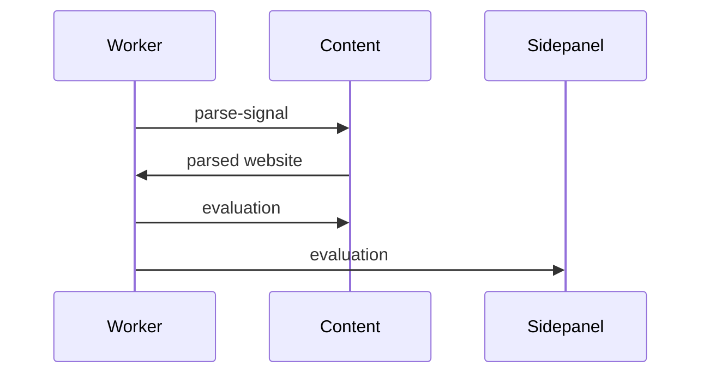

# shared folder
As its name suggests, these are the files that are shared between the different units.
It's important to mention that these files **are built into each application unit**.

## Storages

Storage services are stateless clients to a common storage API.
Currently the implementation uses `chrome.storage.local`, but this can be changed to a custom storage API connected to backend.
(This way we could synchronize the data between different devices for the user.)

### BlackListStorage

BlackListStorage is the storage service for the black listed websites,
meaning these are the websites which **are not analyzed by Sentivisor**.

### ConsentStorage

ConsentStorage is responsible for storing the user's consent to the data collection.
This is important for the GDPR compliance.
In case the user does not give consent, the extension will not collect any data (and basically will not work).

### SupervisorStorage

The user has the opportunity to change the content-based-behaviour of the extension.
SupervisorStorage stores the settings related to this behaviour.
Let's say we have a very harmful website, there are different ways to tackle this website.

#### SupervisionMode

SupervisionMode is the property that sets what is the current content-based-behaviour.
- off - It basically says that we don't collect any data, therefore we don't analyze the website. Good for pausing the extension temporarily. (This is the only mode where we don't collect the data.)
- collect - We collect the data but we don't do any client-side action, meaning we can create a summary of the visited websites but that does not affect the browsing experience in any way.
- inform - Here we simply show an indication (right now just an emoji) that is the result of the evaluation of the current website.
- warning - In case the current website is considered harmful, we show a warning modal with the following options:
  - read this - The modal is simply dismissed, the user can continue browsing
  - add to blacklist - Put the current website into the blacklist, meaning it won't be analyzed anymore
  - skip the content - The user is navigated away from the website (currently to google.com)
- strict - It's the same as warning, except that it does not have a "read this" option

## Messages among application parts

Messages are sent across application units. For this we need structured messages and a mechanism which can send and receive these structured messages.

### An example of message-chain

The most typical message-chain in this application:

*worker* listens to [tab changes](../src/worker/worker.ts?plane1#L40) (like new tab is activated), if it happens it sends a signal to *content* (on that tab) to parse it

content (if it is allowed - i.e. [consent](./consent-unit.md) declined, [supervision mode off](#supervisionmode)) [parses current website](../src/content/content.ts?plane1#L61), then sends it to worker to evaluate it:

worker evaluates it by sending the parsed website to the backend, then it [broadcasts](../src/worker/worker.ts?plane1#L117) this response to *sidepanel* if present and the *content* in the activated tab

### Structured messages

In [messages.ts](../src/shared/messages.ts) you can find all the messages which are sent across the application.

By 'sending' I mean that we have events which we send from one side, and listens on the other side. Let's call these kind of events *MessageEvents*.
All *MessageEvents* has the same structure:
- message - this can be any kind of **JSON serializable** data
- response - the shape of the data expected to be returned from the other side

All these event types are listed in `MessageMap`.

#### Query events

There can be "query events", where we don't intend to change any state in the application but to acquire a piece of information.

We might not need to provide any meaningful message to acquire data.

An example for this is `GetPrimaryDomainEvent`.
With this event we query the current tab's primary domain, which is only available from *content*.

But it can happen that we need to provide a meaningful message as well. An example for this is `AnalyzeEvent`, where we provide the parsed (analyzable) content and we expect to get back the evaluation of it.

#### Command events

Command events are MessageEvents where the message is meaningful, but we don't expect any kind of response (fire-and-forget).
An example is `DisplayEvent`. We want to display an evaluation but we don't care when the display is finished or what is the result of the display.

### MessageMediator

The [`MessageMediator`](../src/shared/MessageMediator.ts) is the class that centralizes communication between different parts of the application. It implements a basic pub-sub pattern based on `chrome.runtime.sendMessage`, `chrome.tabs.sendMessage` and `chrome.runtime.onMessage`.

#### Key points
1. **Automatic wrapping/unwrapping**: You don't have to worry about de-/serializing the message. `MessageMediator` makes a JSON string out of the message and sends it to the other side, then unpacks it.
1. **Type safety**: `listen` and `send` methods are built on the `MessageMap` type, so you can be sure that the message and response types are correct.
1. **Unsubscribe mechanism**: When you listen to an event, you get back an `Unsubscribe` function. This function can be called to stop listening for the event, preventing memory leaks.
1. **Tab-specific and tab-less messaging**: In case you'd like to send a message to a specific tab (to the content script), you can provide a `tabId`. Otherwise the message will be sent to "tab-less" listeners (like the worker or sidepanel). \
**Important**: if you send a message from a unit (i.e. worker), then [it won't get the message from itself](https://developer.mozilla.org/en-US/docs/Mozilla/Add-ons/WebExtensions/API/runtime/sendMessage#:~:text=in%20your%20extension%2C-,except%20for%20the%20frame%20that%20called%20runtime.sendMessage,-.).
1. **Possibility to use as Promise**: In case you'd like to use this message mechanism for only a *one-query-one-response* message-chain, then you can type-safely use MessageMediator. (This is built upon the usage of `sendMessage` without *callback* parameter. Check [runtime.sendMessage](https://developer.chrome.com/docs/extensions/reference/api/runtime#method-sendMessage) and [tabs.sendMessage](https://developer.chrome.com/docs/extensions/reference/api/tabs#method-sendMessage) docs for chrome.)

## Themes shared across ui units

*theme-colors.ts* - This should be moved to ui-related, anyway this holds css values for all themes. A theme can be loaded by setting all values of a nested object of `themes` onto a root element. Check example in [stv-root.ts](../src/SidePanel/stv-root.ts?plane1#L80).

## Miscellaneous

There are utilities which are / can be used across the whole application. I.e. *debounce.ts*, *utils.ts*

*ui-related* folder means, these are the utilities which can be only used in a unit which has DOM context (consent, content, SidePanel)

*allowed-languages* determines what websites can be parsed (based on their language) - currently only english is allowed
